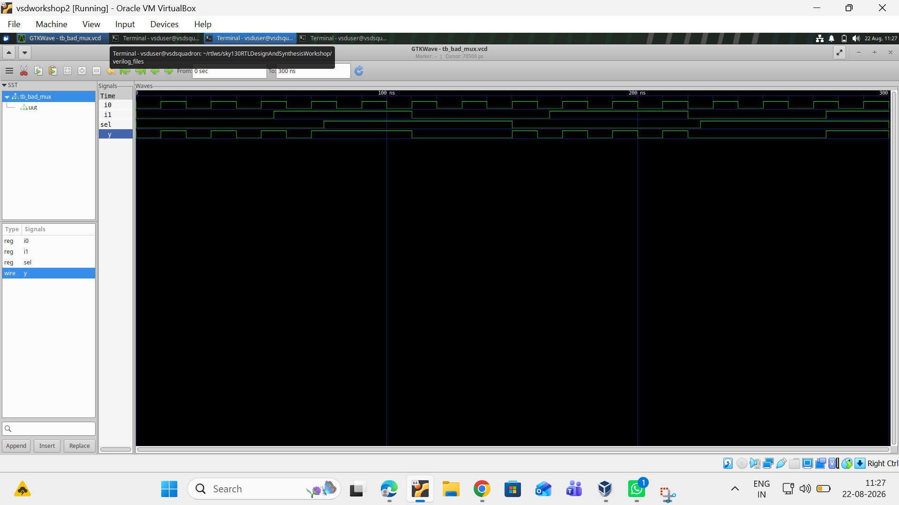
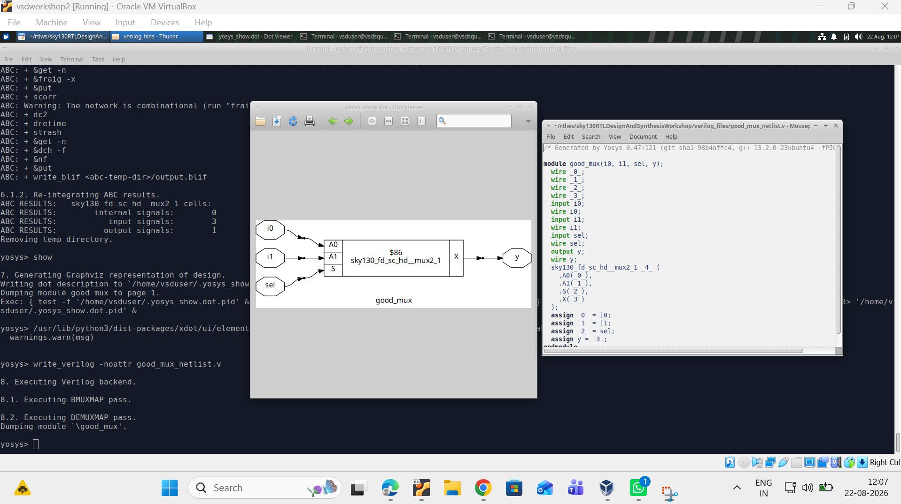

# 2:1 Multiplexer (MUX) – RTL Design, Simulation and Synthesis

## 📑 Index

Click on any topic below to directly go to that section.

1. [About the Experiment](#about-the-experiment)
2. [What is a 2:1 MUX?](#what-is-a-21-mux)
3. [Tools Used](#tools-used)
4. [RTL Design](#rtl-design)
5. [Simulation](#simulation)
6. [GTKWave Output](#gtkwave-output)
7. [Synthesis Using Yosys](#synthesis-using-yosys)
8. [Synthesized Circuit](#synthesized-circuit)
9. [Generated Netlist](#generated-netlist)
10. [Design Flow](#design-flow)
11. [Project Files](#project-files)
12. [Result](#result)
13. [What I Learned](#what-i-learned)

---

## About the Experiment

In this experiment, I worked on a simple **2:1 Multiplexer (MUX)** using Verilog.

The main purpose of this experiment was to understand how a small RTL design is written, simulated, and synthesized.

I first wrote the Verilog design and checked its functionality through simulation. Then I used GTKWave to observe the waveform. After confirming that the design was working correctly, I synthesized it using Yosys.

I also used the **Sky130 standard cell library** to see how the RTL design gets mapped to a standard cell.

The MUX was mapped to the Sky130 cell **sky130_fd_sc_hd__mux2_1**.

---

## What is a 2:1 MUX?

A **2:1 Multiplexer** is a digital circuit that selects one input from two available inputs and sends the selected input to the output.

The signals used in this experiment are:

* **i0** – Input 0
* **i1** – Input 1
* **sel** – Select signal
* **y** – Output

The working is simple:

**sel = 0 → y = i0**

**sel = 1 → y = i1**

The Boolean expression for the MUX is:

**y = (~sel & i0) | (sel & i1)**

---

## Tools Used

I used the following tools for this experiment:

* **Verilog** – RTL design
* **Yosys** – synthesis
* **Sky130 Standard Cell Library** – technology mapping
* **GTKWave** – waveform viewing
* **Graphviz** – circuit visualization
* **VirtualBox** – Linux/EDA environment

---

## RTL Design

The 2:1 MUX was designed using a simple combinational Verilog logic.

The output depends on the select signal. If the select signal is 0, the first input is passed to the output. If the select signal is 1, the second input is passed to the output.

The main logic used for the MUX is:

**y = sel ? i1 : i0**

Since this is a combinational circuit, there is no clock or reset signal.

---

## Simulation

After completing the RTL design, I created a testbench and simulated the MUX.

The simulation generated a waveform file. I opened this waveform using **GTKWave** and checked the input, select, and output signals.

The main signals observed were:

* **i0**
* **i1**
* **sel**
* **y**

The purpose of the simulation was to make sure that the output was selecting the correct input for different values of the select signal.

---

## GTKWave Output

The following image shows the waveform obtained from my simulation.

### Observation

From the waveform, I observed that:

* When **sel = 0**, the output **y follows i0**.
* When **sel = 1**, the output **y follows i1**.

The waveform matches the expected behavior of a 2:1 MUX, so the simulation was successful.

[⬆️ Back to Index](#-index)

---

## Synthesis Using Yosys

After verifying the design through simulation, I moved on to the synthesis stage using **Yosys**.

The synthesis process involved reading the RTL, optimizing the design, mapping it to the Sky130 standard cell library, and generating the synthesized netlist.

The Yosys synthesis result showed:

* Internal signals: 0
* Input signals: 3
* Output signals: 1

The design was successfully mapped to the Sky130 MUX cell **sky130_fd_sc_hd__mux2_1**.

---

## Synthesized Circuit

After synthesis, I used Yosys to view the generated circuit.

The synthesized circuit contains the two data inputs, the select input, and the output.

The screenshot also shows the Yosys synthesis information and the generated netlist.

The circuit structure matches the expected behavior of a 2:1 MUX.

[⬆️ Back to Index](#-index)

---

## Generated Netlist

After synthesis, Yosys generated a Verilog netlist.

The important standard cell used in the synthesized design is:

**sky130_fd_sc_hd__mux2_1**

This shows how the simple RTL MUX was converted into a technology-specific standard-cell implementation.

---

## Design Flow

The complete flow I followed in this experiment was:

**Verilog RTL → Testbench → Simulation → GTKWave → Waveform Verification → Yosys Synthesis → Sky130 Technology Mapping → Synthesized Netlist → Synthesized Circuit**

---

## Project Files

My GitHub repository can be organized like this:

**good-mux/**

* good_mux.v
* tb_good_mux.v
* tb_good_mux.vcd
* good_mux_netlist.v
* gtkwave_simulation_output.png
* yosys_synthesis_output.png
* README.md

### Important

Keep these two image files in the **same folder as README.md**:

**gtkwave_simulation_output.png**

**yosys_synthesis_output.png**

This is important because GitHub uses these filenames to display the images in the README.

---

## Result

The **2:1 MUX was successfully designed, simulated, synthesized, and mapped**.

The GTKWave waveform confirmed that the output correctly follows the selected input.

The Yosys synthesis confirmed that the design was mapped to the Sky130 standard cell **sky130_fd_sc_hd__mux2_1**.

The synthesized circuit also showed the expected MUX structure.

Overall, the experiment was completed successfully.

[⬆️ Back to Index](#-index)

---

## What I Learned

Through this experiment, I got a better understanding of the basic **RTL-to-netlist flow**.

I learned how to:

* Write a simple 2:1 MUX using Verilog.
* Create and run a testbench.
* Check simulation waveforms using GTKWave.
* Synthesize RTL using Yosys.
* Use the Sky130 standard cell library.
* Generate a synthesized netlist.
* View the synthesized circuit.

Overall, this experiment helped me understand how a simple Verilog design moves from:

**RTL Design → Simulation → Synthesis → Standard Cell Mapping**

[⬆️ Back to Index](#-index)
