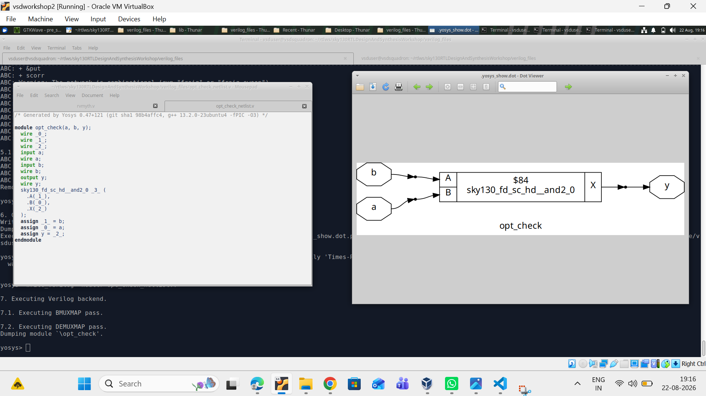
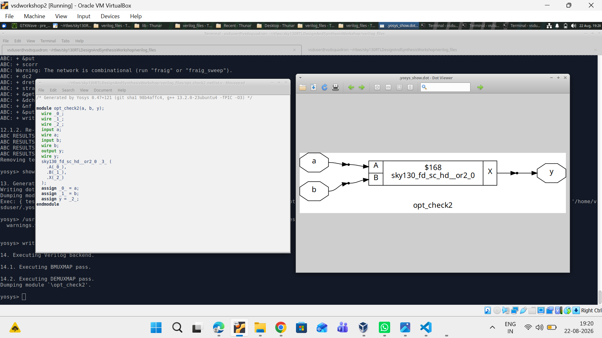
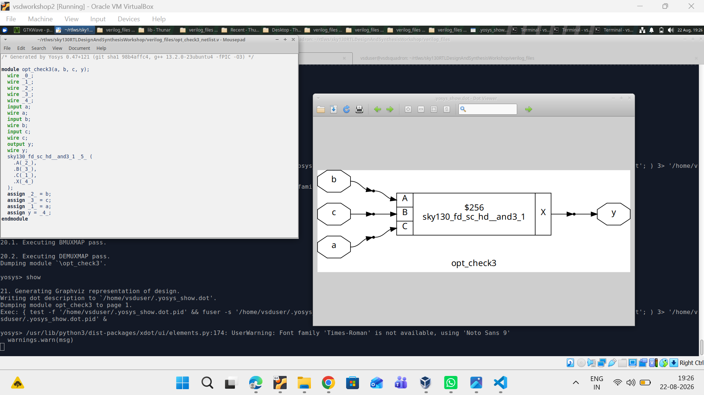
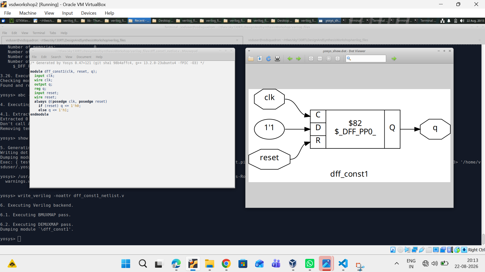
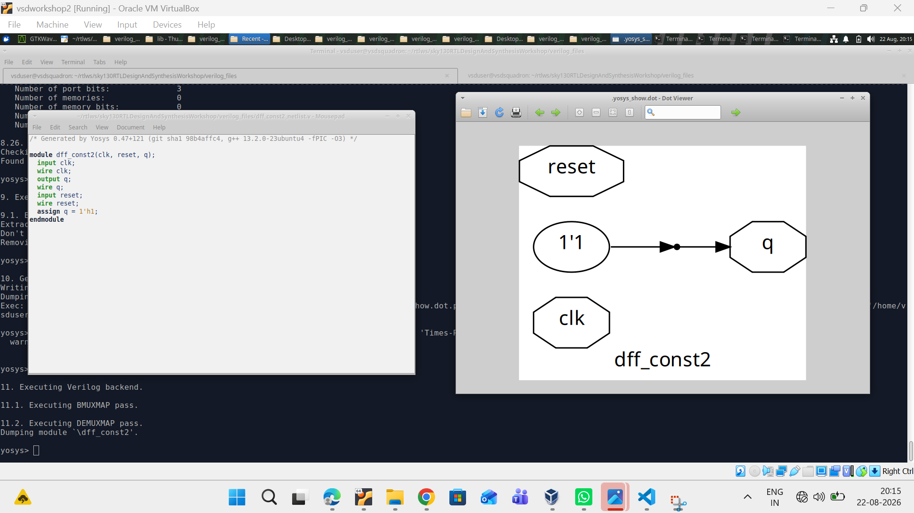
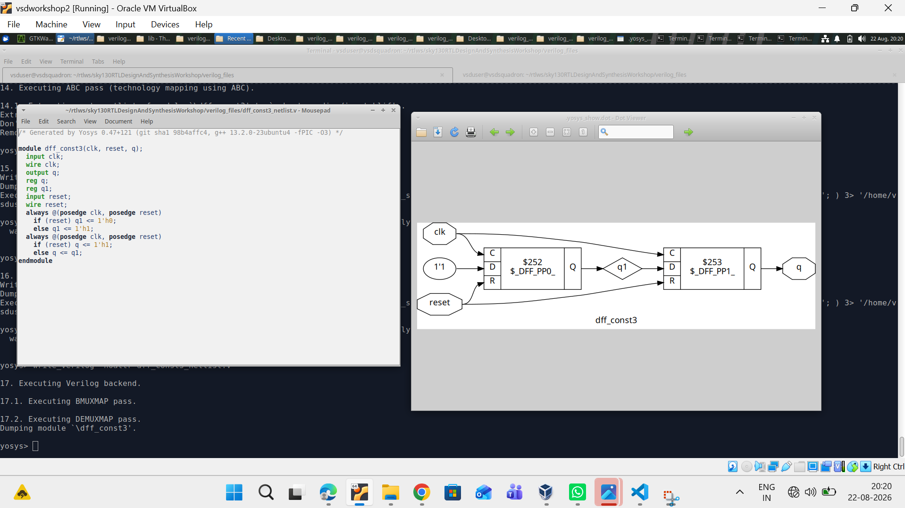
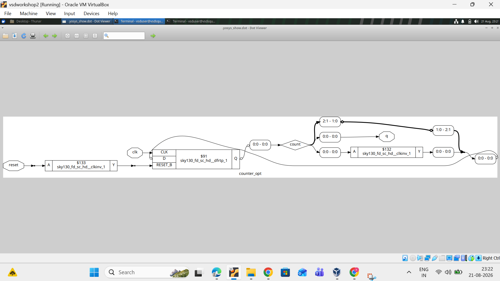

# RTL Design and Synthesis Experiments using Yosys and Sky130

## 📑 Index

Click on any topic below to directly go to that section.

1. [About the Experiments](#about-the-experiments)
2. [Tools Used](#tools-used)
3. [Experiment 1 – Logic Optimization](#experiment-1--logic-optimization)
4. [Experiment 1.1 – AND Gate Optimization](#experiment-11--and-gate-optimization)
5. [Experiment 1.2 – OR Gate Optimization](#experiment-12--or-gate-optimization)
6. [Experiment 1.3 – Three-Input AND Optimization](#experiment-13--three-input-and-optimization)
7. [Experiment 2 – Sequential Logic and Counter Optimization](#experiment-2--sequential-logic-and-counter-optimization)
8. [D Flip-Flop with Constant Input](#d-flip-flop-with-constant-input)
9. [Counter Optimization](#counter-optimization)
10. [Design Flow](#design-flow)
11. [Project Files](#project-files)
12. [Results](#results)
13. [What I Learned](#what-i-learned)

---

# About the Experiments

In these experiments, I worked with **Verilog RTL design, logic optimization, synthesis, and technology mapping using Yosys and the Sky130 standard cell library**.

The main goal was to understand what happens to a Verilog design after synthesis and how Yosys optimizes the RTL before mapping it to actual standard cells.

I performed two main experiments:

* **Experiment 1:** Logic optimization
* **Experiment 2:** Sequential logic and counter optimization

For each design, I checked the synthesized circuit using the Yosys graphical view and observed which Sky130 cells were used.

These experiments helped me understand that the RTL written by the designer can be simplified and optimized by the synthesis tool depending on the actual logic present in the design.

---

# Tools Used

The following tools were used during these experiments:

* **Verilog** – RTL design
* **Yosys** – RTL synthesis and optimization
* **Sky130 Standard Cell Library** – technology mapping
* **Graphviz / Dot Viewer** – synthesized circuit visualization
* **VirtualBox** – Linux environment for running the EDA tools

---

# Experiment 1 – Logic Optimization

## Objective

The objective of this experiment was to understand how Yosys performs **logic optimization and technology mapping**.

I used simple combinational logic designs and synthesized them using Yosys.

After synthesis, I viewed the generated circuits and checked which Sky130 standard cells were selected.

The experiment included different logic conditions such as:

* 2-input AND
* 2-input OR
* 3-input AND

This helped me understand how simple RTL expressions are converted into standard-cell implementations.

---

# Experiment 1.1 – AND Gate Optimization

In the first design, the RTL represented a simple **AND operation** between two inputs.

The synthesized result was mapped to the Sky130 AND standard cell:

**sky130_fd_sc_hd__and2_0**

The inputs **a** and **b** are connected to the two inputs of the AND cell, and the output is connected to **y**.

### Synthesized Output

The image above shows the synthesized AND gate and the corresponding Sky130 standard cell.

This confirms that Yosys successfully recognized the AND operation and mapped it to an appropriate library cell.

---

# Experiment 1.2 – OR Gate Optimization

The second design was based on a simple **OR operation**.

After synthesis, Yosys mapped the design to:

**sky130_fd_sc_hd__or2_0**

The inputs **a** and **b** are connected to the OR gate, and the result is available at the output **y**.

### Synthesized Output

The synthesized circuit clearly shows the Sky130 OR standard cell.

This demonstrates how a simple Boolean operation in RTL is converted into a technology-specific standard cell during synthesis.

---

# Experiment 1.3 – Three-Input AND Optimization

The next design used three inputs:

* **a**
* **b**
* **c**

The output was generated using a three-input AND operation.

After synthesis, Yosys mapped the design to:

**sky130_fd_sc_hd__and3_1**

### Synthesized Output

The image shows all three inputs connected to the Sky130 three-input AND cell.

This was useful for understanding that the synthesis tool does not always need to build a larger logic function using multiple two-input gates when a suitable standard cell is already available in the technology library.

---

# Experiment 2 – Sequential Logic and Counter Optimization

## Objective

The second experiment focused on **sequential logic**.

I worked with D flip-flop based designs and a counter design to understand how Yosys handles clocked logic, reset conditions, constant values, and sequential optimization.

The designs included:

* D flip-flop with reset
* D flip-flop with constant output
* Two-stage D flip-flop design
* Counter optimization

This experiment helped me understand the difference between **combinational logic** and **sequential logic** during synthesis.

---

# D Flip-Flop with Constant Input

In this part of the experiment, a D flip-flop was designed with a constant value at its input.

The design contains:

* Clock
* Reset
* Constant data input
* Output **q**

After synthesis, Yosys identified the flip-flop and mapped it to a Sky130 sequential cell.

### Synthesized Output

The output shows the clock, reset, constant input, and the synthesized D flip-flop.

The result demonstrates that Yosys can identify sequential elements from behavioral Verilog and map them to suitable standard cells.

---

# D Flip-Flop with Constant Output

In another case, the output was directly determined by a constant value.

The synthesis tool recognized that the actual logic could be simplified because the output does not depend on the clocked behavior in the same way as a normal D flip-flop.

### Synthesized Output

The synthesized circuit shows the simplified structure.

This experiment helped me understand an important concept in synthesis: **if some logic does not affect the final result, the synthesis tool can remove or simplify that logic.**

---

# Two-Stage D Flip-Flop Optimization

Another sequential design used two D flip-flops connected one after another.

The design contains:

* Clock
* Reset
* Constant input
* First flip-flop
* Second flip-flop
* Output **q**

### Synthesized Output

The image shows the two sequential elements and their connections.

This helped me understand how multiple sequential elements are represented after synthesis and how Yosys maps them to Sky130 flip-flop cells.

---

# Counter Optimization

The final design in this set was a **counter optimization experiment**.

The synthesized circuit contains sequential logic along with combinational logic used for the counter operation.

The design includes a reset signal, clocked storage, and logic used to generate the required counter behavior.

### Synthesized Output

The synthesized circuit shows the Sky130 cells used for the counter implementation.

This experiment was particularly useful because it shows that a higher-level RTL design can turn into a combination of:

* Flip-flops
* Clock-related cells
* Combinational logic
* Multiplexer logic

after synthesis and technology mapping.

---

# Design Flow

The overall flow followed in these experiments was:

**Verilog RTL**

↓

**Yosys RTL Processing**

↓

**Logic Optimization**

↓

**Technology Mapping using Sky130**

↓

**Generated Netlist**

↓

**Yosys Graphical Circuit View**

↓

**Analysis of Synthesized Design**

---

# Project Files

A simple GitHub folder structure can be maintained like this:

**RTL-Synthesis-Experiments/**

* README.md
* opt_check.v
* opt_check_netlist.v
* opt_check2.v
* opt_check2_netlist.v
* opt_check3.v
* opt_check3_netlist.v
* dff_const1.v
* dff_const1_netlist.v
* dff_const2.v
* dff_const2_netlist.v
* dff_const3.v
* dff_const3_netlist.v
* counter_opt.v
* counter_opt_netlist.v
* and_gate_output.png
* or_gate_output.png
* and3_gate_output.png
* dff_const1_output.png
* dff_const2_output.png
* dff_const3_output.png
* counter_opt_output.png

Keep all the image files in the same folder as **README.md** so that GitHub can display them correctly.

---

# Results

The experiments were successfully completed using Yosys and the Sky130 standard cell library.

### Experiment 1

The combinational designs were successfully optimized and mapped to suitable Sky130 cells.

The synthesized results included:

* **AND2 cell:** sky130_fd_sc_hd__and2_0
* **OR2 cell:** sky130_fd_sc_hd__or2_0
* **AND3 cell:** sky130_fd_sc_hd__and3_1

The synthesized diagrams matched the expected Boolean logic.

### Experiment 2

The sequential designs were successfully synthesized and optimized.

The D flip-flop experiments demonstrated how Yosys handles clock, reset, and constant signals.

The counter experiment showed how a larger sequential RTL design can be converted into a combination of flip-flops and combinational standard cells.

---

# What I Learned

These experiments gave me a better understanding of what happens between **RTL coding and actual hardware implementation**.

I learned that synthesis is not just about converting Verilog into another format. Yosys also analyzes the logic and tries to simplify it before mapping it to the available standard cells.

Some important things I learned were:

* How simple Boolean operations are mapped to standard cells.
* How Yosys optimizes unnecessary logic.
* How combinational logic differs from sequential logic.
* How D flip-flops are identified during synthesis.
* How reset and clock signals are handled.
* How constant signals can lead to logic simplification.
* How a counter is represented using flip-flops and combinational logic.
* How the Sky130 library is used during technology mapping.
* How to inspect a synthesized circuit using the Yosys graphical view.

Overall, these experiments helped me understand the practical **RTL → Optimization → Technology Mapping → Netlist** flow and gave me hands-on experience with the tools used in digital IC design.
