# PicoRV32A ASIC Synthesis using OpenLane and Sky130A

## 📑 Index

Click on any topic below to directly go to that section.

1. [About the Experiment](#about-the-experiment)
2. [Tools Used](#tools-used)
3. [Design Configuration](#design-configuration)
4. [OpenLane Setup](#openlane-setup)
5. [Synthesis Flow](#synthesis-flow)
6. [Technology Mapping](#technology-mapping)
7. [Synthesized Netlist](#synthesized-netlist)
8. [Synthesis Statistics](#synthesis-statistics)
9. [Static Timing Analysis](#static-timing-analysis)
10. [Key Results](#key-results)
11. [Project Outputs](#project-outputs)
12. [What I Learned](#what-i-learned)
13. [Conclusion](#conclusion)
14. [Future Work](#future-work)

---

## About the Experiment

This experiment focuses on the synthesis of the **PicoRV32A RISC-V processor** using the **OpenLane ASIC design flow** with the **Sky130A PDK**.

I worked through the flow step by step, starting with the design configuration and OpenLane setup, followed by RTL synthesis, technology mapping, netlist generation, synthesis statistics, and static timing analysis.

The main objective was to understand how a **Verilog RTL design is converted into a technology-mapped ASIC netlist** using an open-source EDA flow.

---

## Tools Used

| Tool / Technology | Version / Details |
|---|---|
| OpenLane | v0.21 |
| Yosys | 0.9+3621 |
| OpenSTA | 2.3.0 |
| PDK | Sky130A |
| Standard Cell Library | `sky130_fd_sc_hd` |
| HDL | Verilog |
| Operating System | Linux / Ubuntu |

---

## Design Configuration

The PicoRV32A design was configured with the following parameters:

| Parameter | Value |
|---|---|
| Design Name | `picorv32a` |
| Clock Port | `clk` |
| Clock Period | `5.000 ns` |
| PDK | `sky130A` |
| Standard Cell Library | `sky130_fd_sc_hd` |

### Configuration Screenshot

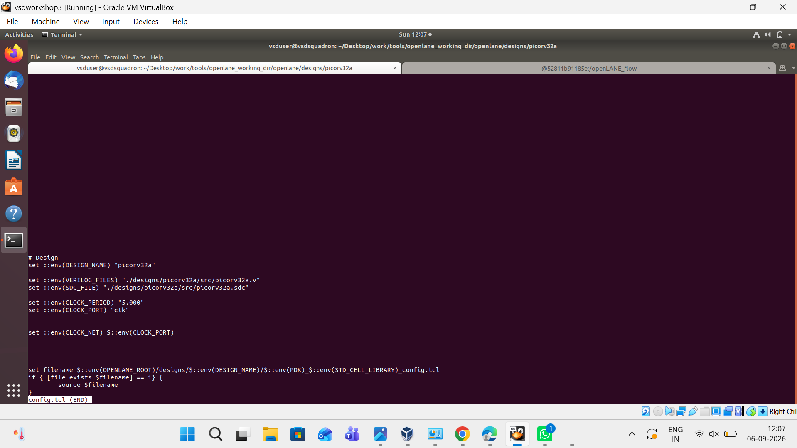

---

## OpenLane Setup

I started OpenLane in **interactive mode** and prepared the PicoRV32A design for synthesis.

### Start OpenLane

```bash
flow.tcl -interactive
```

### Prepare the Design

```tcl
package require openlane 0.9
prep -design picorv32a
```

### OpenLane Interactive Flow

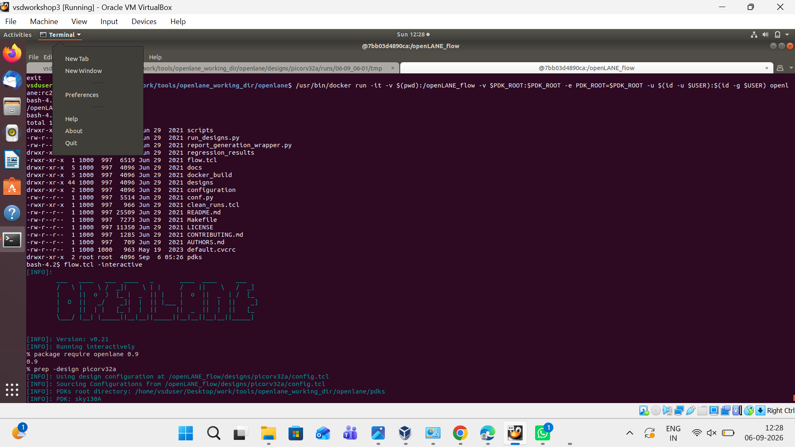

---

## Synthesis Flow

The PicoRV32A RTL was processed through the synthesis flow using **Yosys**.

The main stages of the synthesis process were:

```text
PicoRV32A RTL
      │
      ▼
Yosys Synthesis
      │
      ▼
Logic Optimization
      │
      ▼
ABC Technology Mapping
      │
      ▼
DFF Legalization
      │
      ▼
Sky130 Standard-Cell Mapping
      │
      ▼
Synthesized Netlist
```

### Synthesis Execution

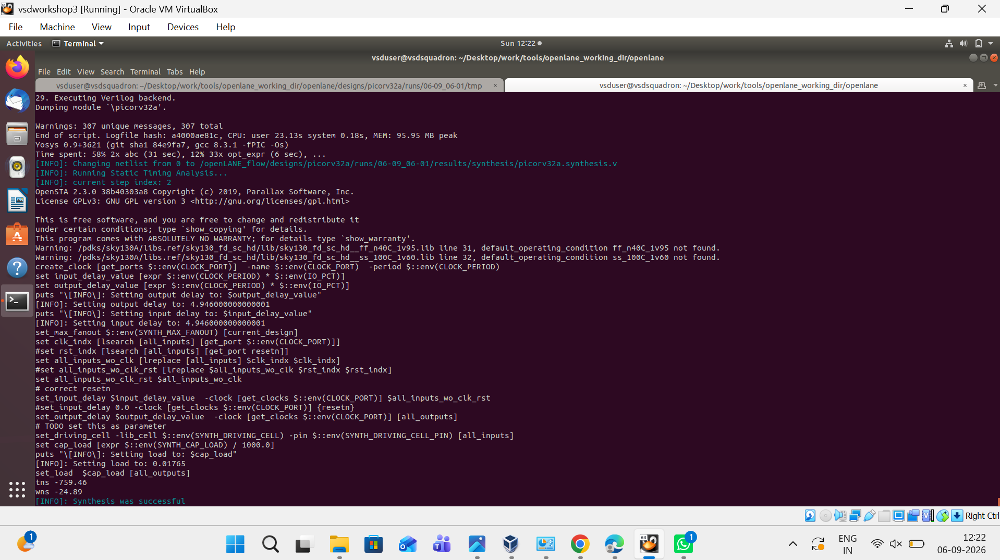

---

## Technology Mapping

After synthesis and optimization, the design was mapped to the **Sky130 high-density standard-cell library**.

```text
sky130_fd_sc_hd
```

The synthesis output also showed the mapping of flip-flop cells to the corresponding Sky130 standard cells.

### Technology Mapping


### DFF Mapping

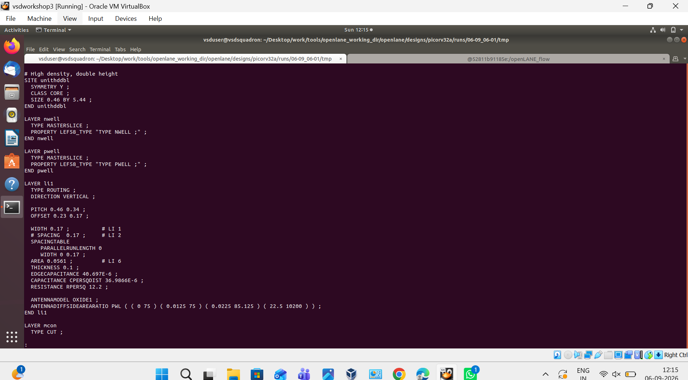

### Mapping Output

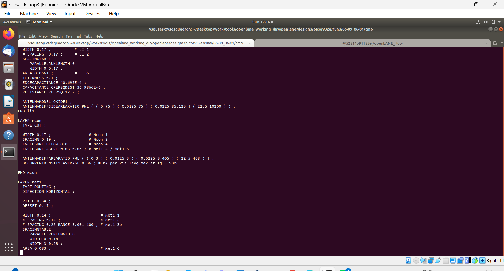

---

## Synthesized Netlist

One of the main outputs of the synthesis stage was the technology-mapped Verilog netlist:

```text
picorv32a.synthesis.v
```

This netlist represents the synthesized PicoRV32A design after mapping the RTL logic to Sky130 standard cells.

### Synthesized Netlist

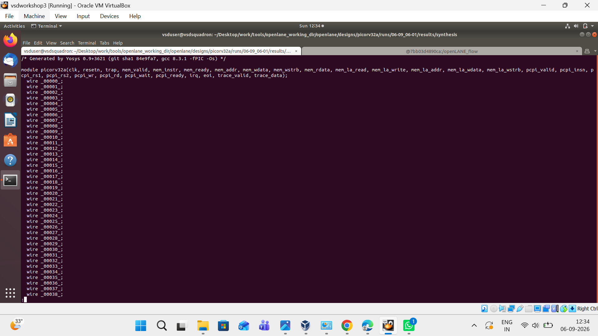

---

## Synthesis Statistics

I checked the Yosys synthesis statistics to understand the size and structure of the synthesized design.

### Main Statistics

| Parameter | Result |
|---|---:|
| Wires | 14,596 |
| Wire Bits | 14,978 |
| Public Wires | 1,565 |
| Public Wire Bits | 1,947 |
| Memories | 0 |
| Processes | 0 |
| **Total Cells** | **14,876** |

### Yosys Synthesis Statistics

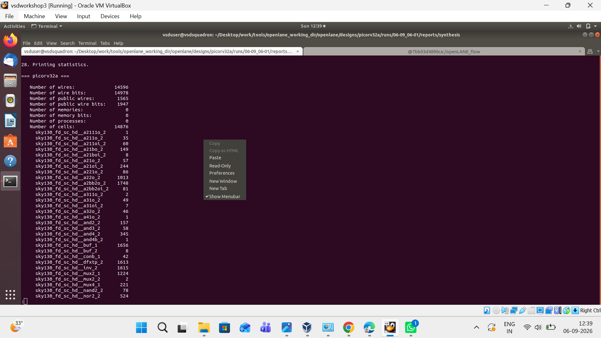

### PicoRV32A Statistics

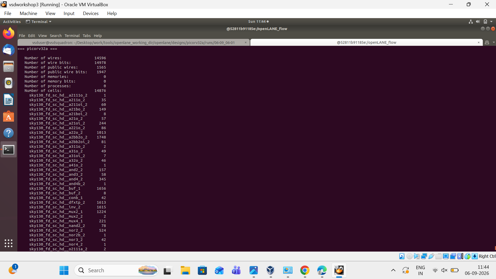

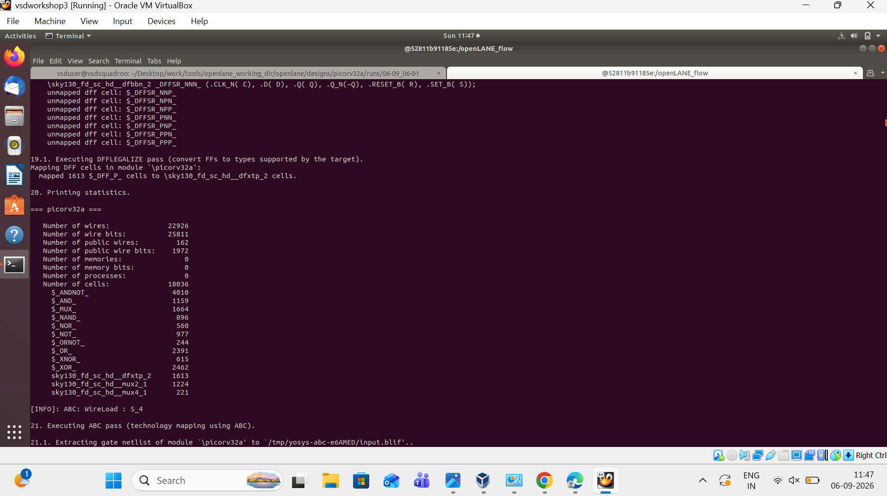

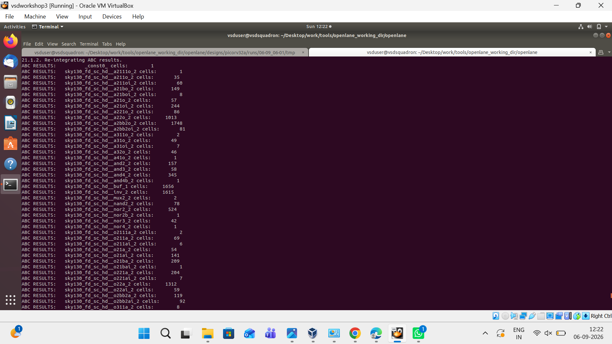

---

## Static Timing Analysis

After synthesis, I used **OpenSTA** to examine the timing information of the synthesized design.

The configured clock period was:

```text
5.000 ns
```

The OpenLane flow generated timing-related reports that were used to inspect the synthesized design.

### Timing / Synthesis Report

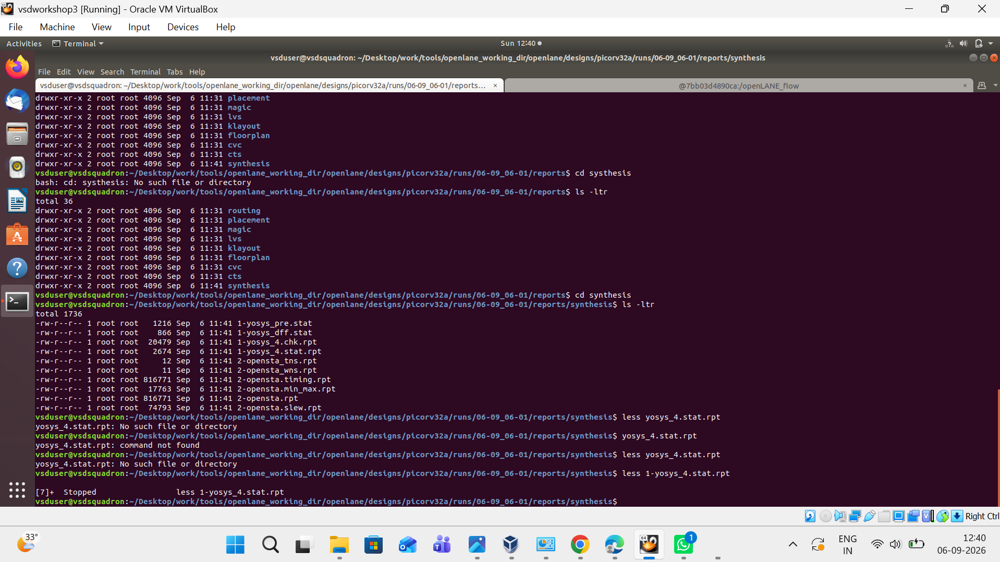

---

## Key Results

The main results obtained from the synthesis experiment are summarized below:

| Parameter | Result |
|---|---|
| Design | PicoRV32A |
| Total Cells | **14,876** |
| Total Wires | **14,596** |
| Wire Bits | **14,978** |
| Public Wires | **1,565** |
| Clock Period | **5.000 ns** |
| PDK | **Sky130A** |
| Standard Cell Library | **sky130_fd_sc_hd** |
| Synthesized Netlist | `picorv32a.synthesis.v` |

---

## Project Outputs

The main outputs generated during this experiment include:

- Technology-mapped Verilog netlist
- Yosys synthesis statistics
- Technology mapping results
- DFF mapping results
- OpenSTA timing reports
- Synthesis reports

---

## What I Learned

Through this experiment, I gained practical experience with the **OpenLane ASIC synthesis flow**.

I learned how to:

- Prepare an RTL design for OpenLane
- Run OpenLane in interactive mode
- Perform synthesis using Yosys
- Optimize RTL logic
- Perform ABC technology mapping
- Map logic to Sky130 standard cells
- Analyze DFF mapping
- Generate a synthesized Verilog netlist
- Analyze synthesis statistics
- Examine timing information using OpenSTA

---

## Conclusion

This experiment helped me understand the practical steps involved in taking a **Verilog RTL design toward ASIC implementation** using an open-source EDA flow.

The PicoRV32A design was successfully synthesized, and the flow generated the synthesized netlist, synthesis statistics, technology-mapping results, and timing reports.

This provided hands-on experience with the early stages of the **RTL-to-ASIC design flow**.

---

## Future Work

The next stages I plan to explore are:

1. Floorplanning
2. Placement
3. Clock Tree Synthesis (CTS)
4. Routing
5. Design Rule Checking (DRC)
6. Layout Versus Schematic (LVS)
7. Post-route timing analysis
8. GDSII generation

