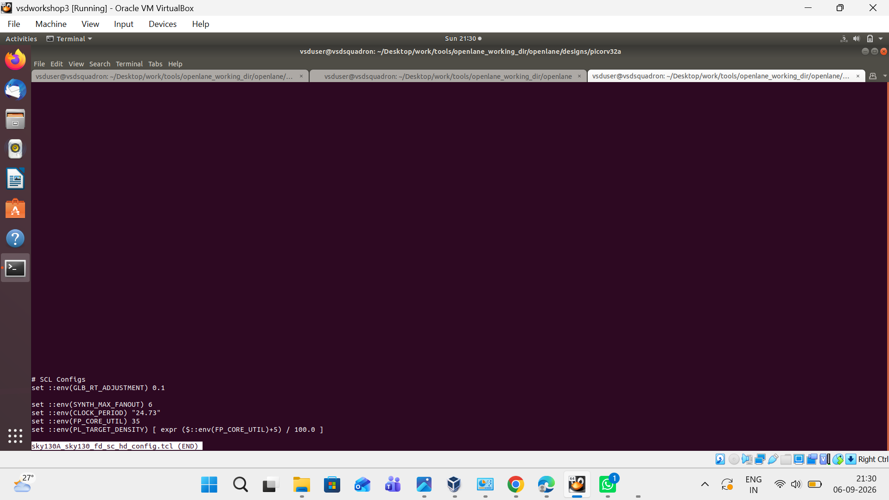
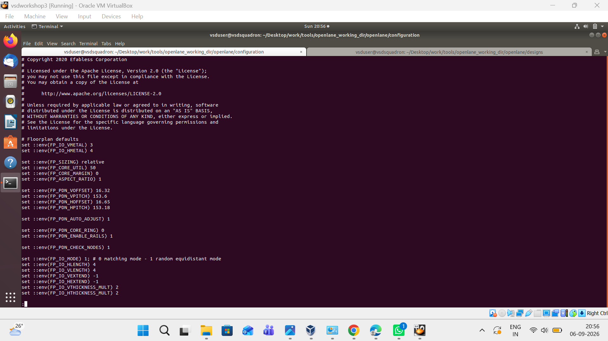
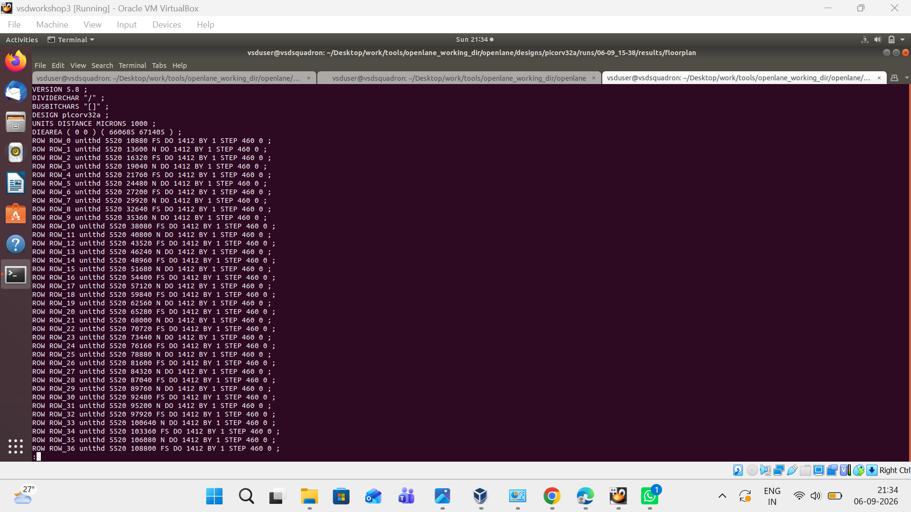
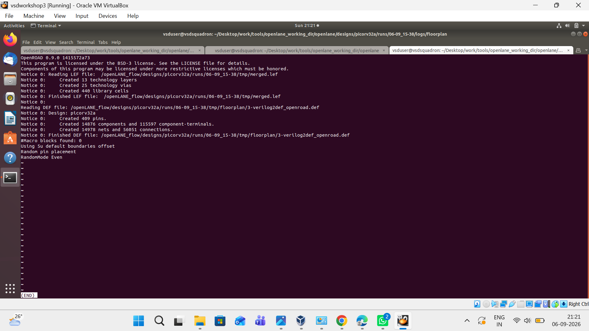
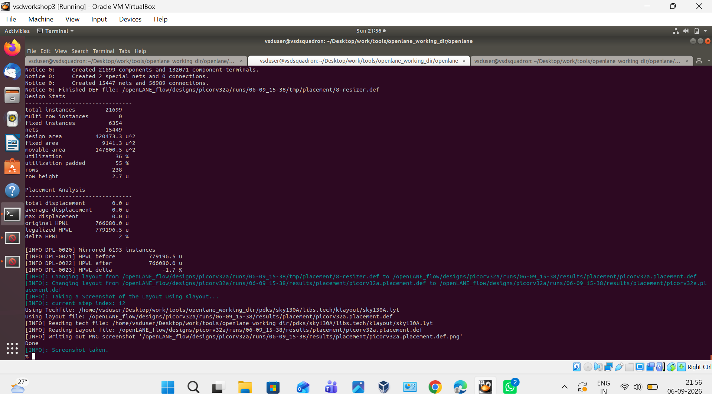
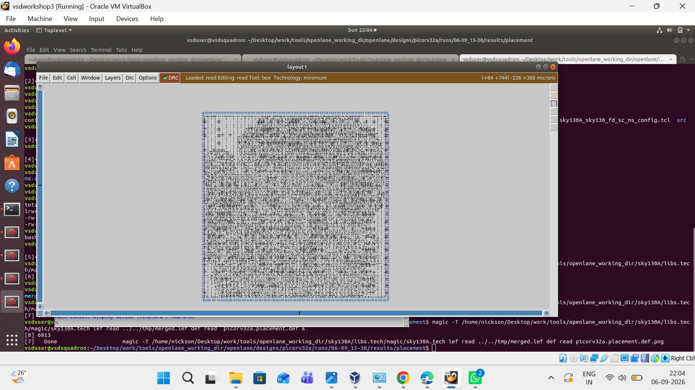
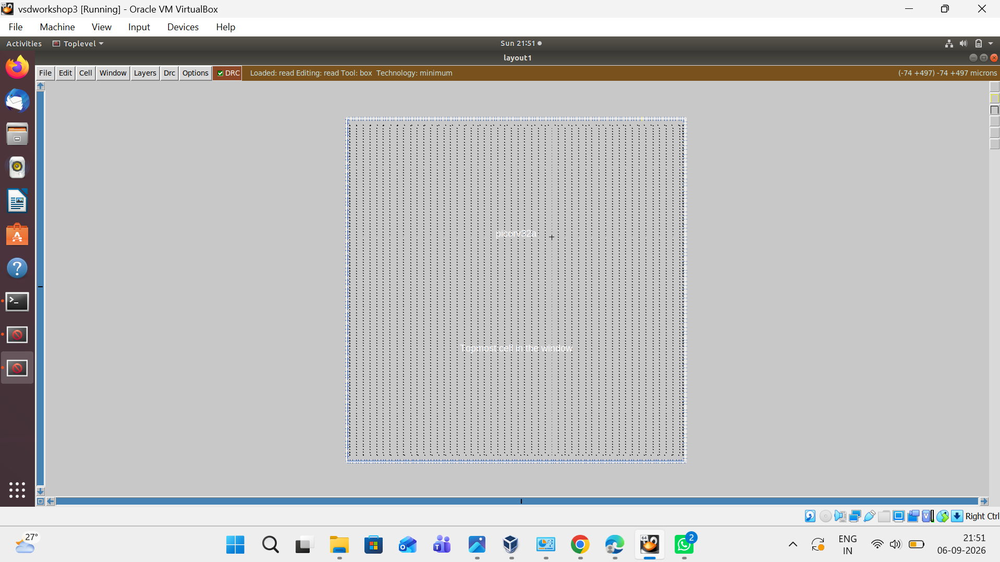

# PicoRV32A Physical Design using OpenLane and Sky130A

## 📑 Index

Click on any topic below to directly go to that section.

1. [About the Project](#1-about-the-project)
2. [Tools Used](#2-tools-used)
3. [OpenLane Configuration](#3-openlane-configuration)
4. [Floorplan Configuration](#4-floorplan-configuration)
5. [Floorplan Generation](#5-floorplan-generation)
6. [I/O Placement](#6-io-placement)
7. [Standard Cell Placement](#7-standard-cell-placement)
8. [Placement Analysis](#8-placement-analysis)
9. [Placement Layout](#9-placement-layout)
10. [Magic Layout](#10-magic-layout)
11. [Conclusion](#11-conclusion)

---

# 1. About the Project

This project demonstrates the **physical design flow of the PicoRV32A RISC-V processor** using **OpenLane** and the **Sky130A PDK**.

The design was taken through the initial physical design stages from configuration to placement and layout visualization.

### Design Flow

```text
OpenLane Configuration
          ↓
     Floorplanning
          ↓
     I/O Placement
          ↓
 Standard Cell Placement
          ↓
  Placement Analysis
          ↓
  Layout Visualization
```

---

# 2. Tools Used

- **OpenLane**
- **OpenROAD**
- **Yosys**
- **Sky130A PDK**
- **KLayout**
- **Magic**
- **Ubuntu/Linux**

---

# 3. OpenLane Configuration

The Sky130A standard-cell library was configured for the PicoRV32A design.

Important parameters include:

```tcl
set ::env(GLB_RT_ADJUSTMENT) 0.1
set ::env(SYNTH_MAX_FANOUT) 6
set ::env(CLOCK_PERIOD) "24.73"
set ::env(FP_CORE_UTIL) 35
set ::env(PL_TARGET_DENSITY) [expr ($::env(FP_CORE_UTIL)+5) / 100.0]
```

### Configuration Output



---

# 4. Floorplan Configuration

The floorplan parameters were configured for the design.

```tcl
set ::env(FP_SIZING) relative
set ::env(FP_CORE_UTIL) 50
set ::env(FP_CORE_MARGIN) 0
set ::env(FP_ASPECT_RATIO) 1
```

Power distribution network parameters were also configured.

### Floorplan Configuration Output



---

# 5. Floorplan Generation

The floorplan was generated using **OpenROAD**.

The output shows the creation of the physical design database.

### Floorplan Results

```text
Created 409 pins
Created 14876 components
Created 14978 nets
```

### Floorplan Output



---

# 6. I/O Placement

The I/O pins were placed around the core after floorplanning.

The OpenROAD log shows:

```text
Random pin placement
RandomMode Even
```

### I/O Placement Output



---

# 7. Standard Cell Placement

The synthesized standard cells were placed inside the core area.

The placement stage generated the physical placement information for the PicoRV32A design.

### Placement Output



---

# 8. Placement Analysis

The placement stage produced the following design statistics.

| Parameter | Result |
|---|---:|
| Total Instances | 21,699 |
| Fixed Instances | 6,354 |
| Nets | 15,449 |
| Design Area | 420,473.3 µm² |
| Fixed Area | 9,141.3 µm² |
| Movable Area | 147,800.5 µm² |
| Utilization | 36% |
| Padded Utilization | 55% |
| Rows | 238 |
| Row Height | 2.7 µm |

### HPWL Analysis

```text
Original HPWL      766080.0 µ
Legalized HPWL     779196.5 µ
Delta HPWL         2%
```

The placement process also reported:

```text
Mirrored 6193 instances
```

---

# 9. Placement Layout

The generated placement was visualized using **KLayout**.

The layout shows the physical arrangement of the standard cells inside the PicoRV32A core.

### KLayout Output



---

# 10. Magic Layout

The placement database was also opened using **Magic** with the Sky130A technology file.

### Magic Layout Output



---

# 11. Conclusion

The PicoRV32A RISC-V processor was successfully taken through the initial physical design stages using **OpenLane, OpenROAD and Sky130A**.

### Completed Stages

- [x] OpenLane Configuration
- [x] Floorplanning
- [x] I/O Placement
- [x] Standard Cell Placement
- [x] Placement Analysis
- [x] KLayout Visualization
- [x] Magic Visualization

### Key Results

```text
Total Instances : 21,699
Nets            : 15,449
Utilization     : 36%
Design Area     : 420,473.3 µm²
Clock Period    : 24.73 ns
```


Electronics and Communication Engineering  
Anurag University
