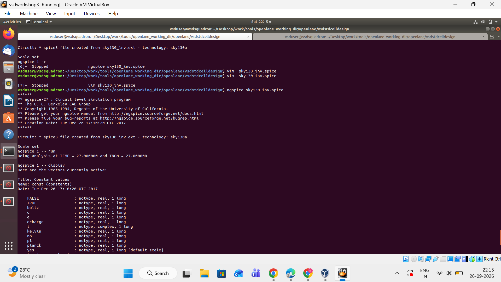
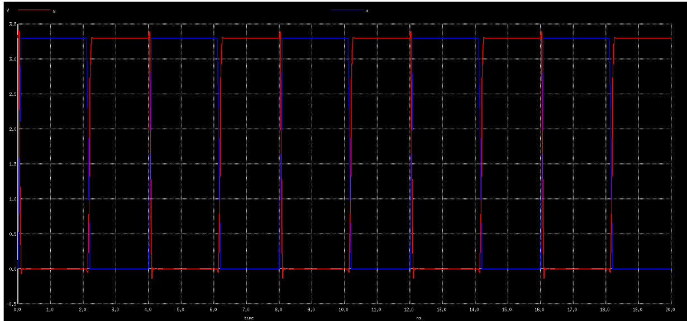
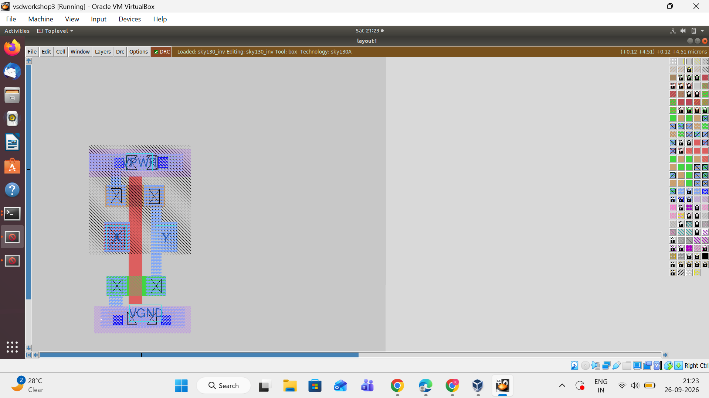

# Module 3 – CMOS Inverter Design, Simulation and Layout

## Overview

This module demonstrates the design, simulation, waveform verification, and physical layout of a **CMOS Inverter** using the **SKY130A PDK**.

The CMOS inverter was simulated using **NGSpice**, and the physical layout was created and viewed using **Magic VLSI**.

---

## Objective

The objective of this module is to understand the complete CMOS inverter implementation flow, starting from the SPICE circuit and simulation and progressing to the physical layout.

The CMOS inverter performs the NOT operation:

```text
Y = NOT(A)
````

Therefore:

| Input (A) | Output (Y) |
| --------- | ---------- |
| 0         | 1          |
| 1         | 0          |

---

## CMOS Inverter

A CMOS inverter consists of:

* PMOS transistor
* NMOS transistor
* VDD supply
* GND/VSS
* Input A
* Output Y

The gates of the PMOS and NMOS transistors are connected together to form the input.

The drains of both transistors are connected together to form the output.

The PMOS source is connected to VDD, while the NMOS source is connected to GND.

### Basic Structure

```text
              VDD
               |
             PMOS
               |
               |
               Y
               |
             NMOS
               |
              GND

               |
               A
             Input
```

---

## Working Principle

### When A = 0

* PMOS is ON.
* NMOS is OFF.
* Output Y is connected to VDD.
* Therefore, Y = 1.

### When A = 1

* PMOS is OFF.
* NMOS is ON.
* Output Y is connected to GND.
* Therefore, Y = 0.

Hence, the circuit performs the NOT logic operation.

---

## Technology Used

The design uses the **SkyWater SKY130A open-source Process Design Kit (PDK)**.

### Technology

```text
SKY130A
```

### Supply Voltage

```text
3.3 V
```

---

## Tools Used

* Linux
* SKY130A PDK
* NGSpice
* Magic VLSI
* SPICE

---

## SPICE Simulation

The CMOS inverter was simulated using NGSpice with the SKY130 technology models.

The simulation was executed using:

```bash
ngspice sky130_inv.spice
```

The transient analysis was performed to observe the input and output waveforms of the inverter.

---

## NGSpice Simulation Output

The NGSpice simulation was successfully executed and the transient analysis was performed.

The simulation confirms that the CMOS inverter produces an output complementary to the input.



---

## Transient Waveform

The waveform shows both the input signal `A` and the output signal `Y`.

* **Blue waveform:** Input `A`
* **Red waveform:** Output `Y`

The output waveform is the logical inverse of the input waveform.

When the input is LOW, the output becomes HIGH.

When the input is HIGH, the output becomes LOW.


---

## Input and Output Verification

The simulated signals demonstrate the expected inverter behavior.

```text
A = 0  →  Y = 1
A = 1  →  Y = 0
```

The input signal switches between approximately 0 V and 3.3 V, and the output responds inversely.



---

## Physical Layout

The CMOS inverter physical layout was created using **Magic VLSI** with the **SKY130A technology**.

The layout contains the required transistor regions, contacts, poly connections, metal interconnections, VDD, GND, input, and output connections.



---

## Layout Description

The physical implementation contains:

* PMOS transistor
* NMOS transistor
* Polysilicon gate
* Diffusion regions
* Metal interconnections
* Contacts
* VDD connection
* GND connection
* Input connection
* Output connection

The PMOS transistor is placed in the upper region near VDD, while the NMOS transistor is placed in the lower region near GND.

---

## Results

The following results were successfully obtained:

| Parameter            | Result     |
| -------------------- | ---------- |
| CMOS Inverter Design | Completed  |
| SKY130A PDK          | Used       |
| SPICE Netlist        | Generated  |
| NGSpice Simulation   | Successful |
| Transient Analysis   | Successful |
| Input Waveform       | Verified   |
| Output Waveform      | Verified   |
| Inverter Logic       | Verified   |
| Physical Layout      | Created    |
| Magic VLSI           | Used       |

---

## Conclusion

The CMOS inverter was successfully designed, simulated, and implemented using the SKY130A PDK.

The NGSpice transient simulation verified the correct NOT-gate operation, where the output signal is the logical inverse of the input signal.

The physical layout was also created using Magic VLSI, demonstrating the transition from circuit-level design to physical implementation.

```text
CMOS Inverter
      ↓
SPICE Netlist
      ↓
NGSpice Simulation
      ↓
Waveform Verification
      ↓
Magic VLSI Layout
      ↓
Physical Implementation
```

---

## Module 3 Summary

**Design:** CMOS Inverter
**Technology:** SKY130A
**Simulation Tool:** NGSpice
**Layout Tool:** Magic VLSI
**Logic Function:** Y = NOT(A)
**Supply Voltage:** 3.3 V

---

## Author

**RTL Design Workshop**

**Module 3 – CMOS Inverter Design, Simulation and Layout**

````

### Your `Module_3` folder should finally look like this

```text
Module_3/
│
├── README.md
├── ngspice.png
├── invertor waveform.png
├── plot y vs time a(1).png
└── inverter_layout.png
````

**Important:** upload the four images into the **same `Module_3` folder** as `README.md`. Otherwise the images won't appear in the README on GitHub.
